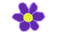

# aetna 🌋🐑

### Aetna is a simulation of imaginary land with its inhabitants.
[Developer Documentation](./technical_documentation.md)

## Terrain

Terrain is generated using [Perlin noise](https://www.wikiwand.com/en/Perlin_noise) and the corresponding color intensities are assigned according to its values.  At the beginning you can choose octaves and frequencies to your liking.
  

## Inhabitants

### Violet flower
Adds some living years to sheep that has eaten it and it emerges instead of cross after some time.
  

  

### Red flower
Adds some living years to sheep that has eaten it (more than violet one) and it emerges instead of cross after some time.

  

  

### Sheep
A living creature moving randomly. It eats flowers and has bigger life span than flowers.
  

  

### Cross
When a sheep dies it emerges on that place for a little time.
  

  

### Volcano
Volcano explodes and simulation slows down when clicking on it and it kills all the sheep around it that are close enough.
  

## Menu

In the menu you have the possibility to choose which figure to add to the simulation scene. Just click on a figure in the menu and then drag it somewhere on the simulation terrain: the new being/object will appear there (not in case if you click exactly on pixel having something there).

  

